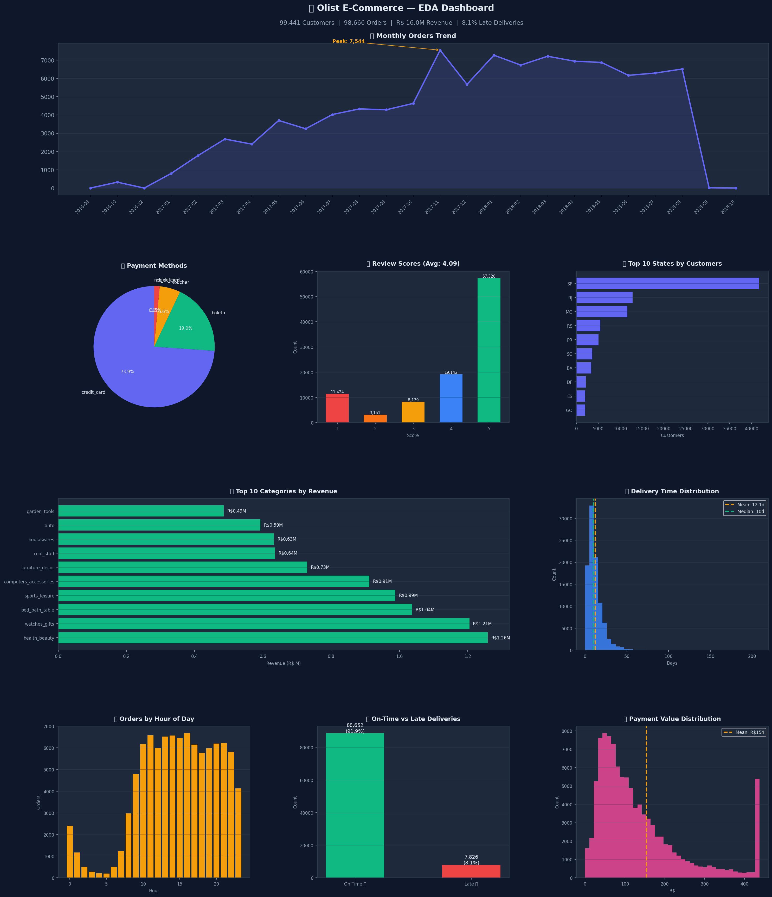
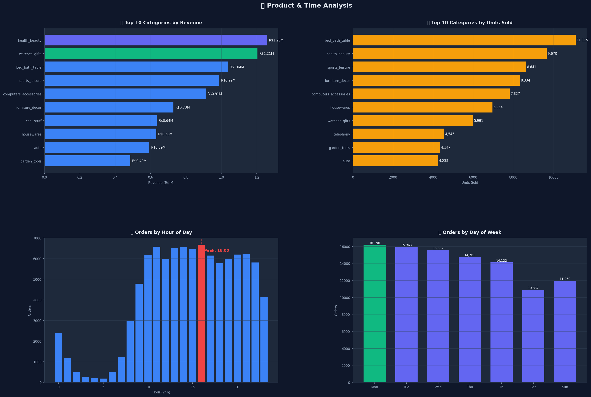
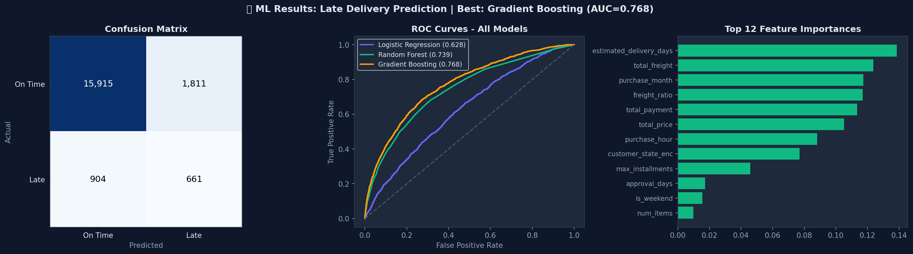
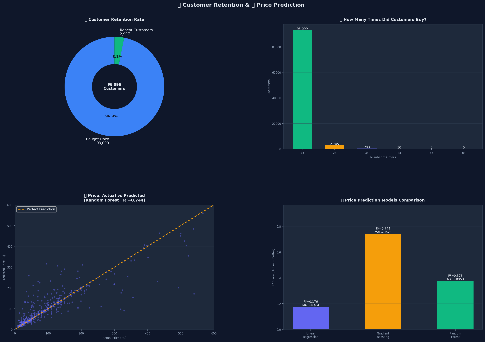
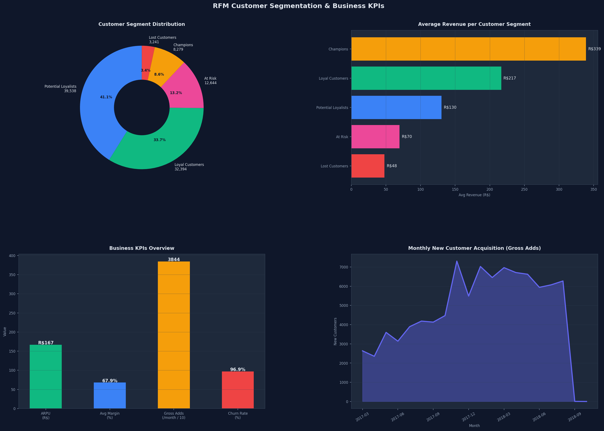

# 🛒 E-Commerce Data Science Project
### Olist Brazilian E-Commerce — Predictive Analytics & Business Insights


---

## 📌 Project Overview

This project analyzes **99,441 orders** from Olist, Brazil's largest e-commerce platform, to extract business insights and build machine learning models for:
- 🚚 **Late Delivery Prediction** — predict if an order will be delayed before it happens
- 💰 **Price Prediction** — estimate product price based on dimensions & category
- 📊 **Business Intelligence** — customer behavior, sales trends & product analysis
- 👥 **RFM Segmentation** — classify customers by behavior and generate actionable recommendations

---

## 📊 Key Results

| Metric | Value |
|--------|-------|
| 📦 Total Orders | 99,441 |
| 💵 Total Revenue | R$ 16,008,872 |
| ⭐ Avg Review Score | 4.09 / 5 |
| 🚚 Late Delivery Rate | 8.1% |
| 🤖 Best ML Model (Delivery) | Gradient Boosting — AUC = **0.768** |
| 💰 Best ML Model (Price) | Random Forest — R² = **0.744** |

---

## 🗂️ Dataset

**Source:** [Olist Brazilian E-Commerce Dataset — Kaggle](https://www.kaggle.com/datasets/olistbr/brazilian-ecommerce)
**Download from my Google Drive:** [Click here to download the processed data](https://drive.google.com/drive/folders/159si9BxbBBRKrhgFc6h__nQ-OkqNCoCa?usp=drive_link)
| File | Rows | Description |
|------|------|-------------|
| orders | 99,441 | Order details & timestamps |
| customers | 99,441 | Customer location & ID |
| order_items | 112,650 | Products per order |
| payments | 103,886 | Payment method & value |
| reviews | 99,224 | Customer review scores |
| products | 32,341 | Product dimensions & category |
| sellers | 3,095 | Seller location |

---

## 🔍 Exploratory Data Analysis

### 📈 Key Findings:
- **Sales grew 8x** from early 2017 to mid-2018
- **São Paulo** accounts for **42%** of all customers
- **73.9%** of payments made by Credit Card
- Peak buying hour: **4:00 PM** | Peak day: **Monday**
- **Health & Beauty** is the top revenue category (R$1.26M)
- **96.9%** of customers buy only once → huge retention opportunity
#### Dashboard Preview:


---

## 🤖 Machine Learning Models

### 1️⃣ Late Delivery Prediction
**Goal:** Predict if an order will be delivered late (Binary Classification)
#### Model Results Visualization:


| Model | AUC Score | F1 Score |
|-------|-----------|----------|
| Logistic Regression | 0.628 | 0.194 |
| Random Forest | 0.739 | 0.301 |
| **Gradient Boosting** ⭐ | **0.768** | **0.328** |

**Top Features:** Estimated delivery days, Freight ratio, Payment value, Customer state, Purchase month

### 2️⃣ Price Prediction
**Goal:** Predict product price based on physical attributes & category
#### Retention and Price Analysis:

| Model | R² Score | MAE |
|-------|----------|-----|
| Linear Regression | 0.177 | R$64.50 |
| Gradient Boosting | 0.378 | R$53.25 |
| **Random Forest** ⭐ | **0.744** | **R$25.14** |

---

## 👥 RFM Segmentation & Business KPIs

#### RFM Dashboard:


### Business KPIs

| KPI | Value |
|-----|-------|
| 💵 ARPU | R$ 166.59 |
| 📦 Avg Product Margin | 67.9% |
| ➕ Avg Gross Adds | 3,844 new customers / month |
| 🔴 Churn Rate | 96.9% |
| 🟢 Retention Rate | 3.1% |

### Customer Segments

| Segment | Customers | Avg Revenue |
|---------|-----------|-------------|
| 🏆 Champions | 8,279 | R$ 339 |
| 💚 Loyal Customers | 32,394 | R$ 217 |
| 🌱 Potential Loyalists | 39,538 | R$ 130 |
| ⚠️ At Risk | 12,644 | R$ 70 |
| ❌ Lost Customers | 3,241 | R$ 48 |

### Business Recommendations
- **Champions** — Launch a VIP program with early access. They spend 2x more than average.
- **Loyal Customers** — Introduce a loyalty points system and bundle discounts.
- **Potential Loyalists** — Send a personalised follow-up email + 10% discount on second order. Converting this segment could increase revenue by ~25%.
- **At Risk** — Win-back campaign with a limited-time offer and free shipping coupon.
- **Lost Customers** — Last resort: 20-30% discount. Remove from marketing list if no response.

---

## 📁 Project Structure

```
E_Commerce_project/
│
├── 📄 data_pipeline.py          # Data cleaning & SQL upload
├── 📄 01_EDA.py                 # Exploratory Data Analysis
├── 📄 02_Feature_Engineering.py # Feature engineering (19 features)
├── 📄 03_ML_Model.py            # ML models - Late delivery prediction
├── 📄 04_Advanced_Analysis.py   # Products, time, retention & price prediction
├── 📄 05_KPIs_RFM.py            # Business KPIs & RFM customer segmentation
│
├── 📁 data/                     # Raw & cleaned CSV datasets
└── 📁 outputs/                  # Generated charts & saved models
```

---

## ▶️ How to Run

```bash
# 1. Install requirements
pip install pandas numpy matplotlib seaborn scikit-learn joblib sqlalchemy

# 2. Run in order
python data_pipeline.py
python 01_EDA.py
python 02_Feature_Engineering.py
python 03_ML_Model.py
python 04_Advanced_Analysis.py
python 05_KPIs_RFM.py
```

---

## 🛠️ Technologies Used

- **Python 3.12**
- **Pandas & NumPy** — Data manipulation
- **Matplotlib & Seaborn** — Data visualization
- **Scikit-learn** — Machine learning models
- **SQLAlchemy** — SQL Server integration
- **Joblib** — Model persistence

---

## 👩‍💻 Author

**Salma Hossam**
- GitHub: [@SalmaHossam167](https://github.com/SalmaHossam167)
- Email: salmahoss666@gmail.com
